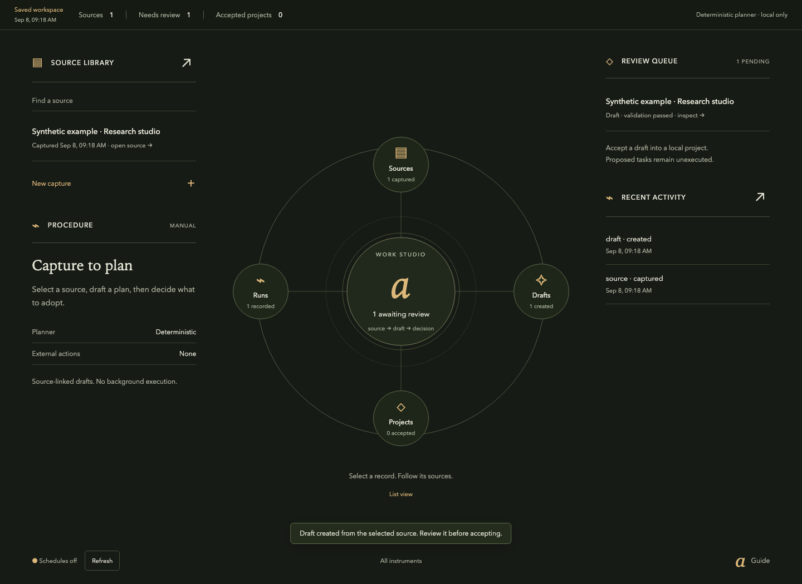
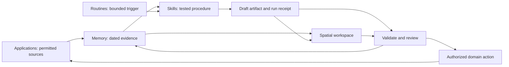

# AgentOS Foundation

**Build a custom operating workspace around Applications, Routines, Memory, and Skills.**

An agent-ready public template for turning repeatable work into a durable system—with a spatial interface that makes the work understandable, reviewable, and controllable.



ARMS supplies the structure. Your domain supplies the objects and workflows. The interface gives those objects a useful place to live.

## Start

Use GitHub’s **Use this template** button, or clone this repository. Then give your coding agent this prompt:

> Read AGENTS.md and START-HERE.md. Help me build an AgentOS for [domain]. Inspect the available environment and ask only for missing workflow, source, authority, or design decisions. Complete templates/product-brief.md, choose a spatial composition, and implement one sourced input → skill → draft → review → accepted result loop. Use the project skills. Keep simulated, unavailable, and live capabilities visibly distinct. Verify the actual workflow and rendered interface before expanding scope.

For the working local reference:

```sh
python3 -m unittest discover -s tests -v
python3 scripts/check.py
python3 -m reference.server
# Open http://127.0.0.1:4321 ; Ctrl-C stops the server.
```

Python 3.11+; no third-party runtime dependencies or API keys. Enter a project brief, create a draft, inspect its sources, and accept or reject it. SQLite persists actual local records in ignored `.agentos/`. The planner is a **deterministic reference**, not an LLM. No external actions or background schedules run.

## What is here

| Layer | Contents |
| --- | --- |
| Playbook | [Build sequence](docs/playbook.md), [ARMS dynamics](docs/arms.md), [architecture](docs/architecture.md), [operations](docs/operations.md) |
| Design | [App shell rules](docs/design/app-shell.md), [Spatial design](docs/design/spatial.md), [interaction contracts](docs/design/interactions.md), [visual grammar](docs/design/visual-grammar.md), [critique rubric](docs/design/rubric.md) |
| Agent skills | Original, project-scoped [skill library](skills/README.md), including design workflows and ARMS construction |
| Providers | [Subscriptions and ACP](docs/providers.md), [T3/Hermes patterns](docs/provider-patterns.md), opt-in [transport modules](adapters/README.md) |
| Composer | Dedicated [composer design skill](.agents/skills/composer-design/SKILL.md) and [interaction contract](docs/design/composer.md) |
| Customization | [Product and engineering templates](templates/README.md), three [domain profiles](examples/README.md), [scaffolder](scripts/new_workspace.py) |
| Implementation | Small [reference workspace](reference/README.md), storage and review boundary, browser UI, automated tests |
| Evidence | [Acceptance gates](docs/acceptance.md), [source review](docs/patterns.md), [provenance and rights](docs/provenance.md), [verification](docs/verification.md) |
| Capability map | [Catalog](skills/catalog.md) of the supplied skill capabilities, including optional specialist workflows |

Create an independent copy with `python3 scripts/new_workspace.py ../my-agentos --name "My AgentOS" --profile research`. The destination must not exist. The scaffold excludes runtime data and Git history.

## The central loop



The ARMS learning order is **Skills → Memory → Routines → Applications**. A real run may cross all four. An agent is a worker within this system; it is not what the “A” stands for.

Build it for yourself using your own native Claude Code, Codex, Grok Build or Cursor session. Keep each instance private and scoped; direct model endpoints use their own explicit credentials. See the researched [subscription and ACP guide](docs/providers.md).

This foundation is provider- and framework-neutral. The reference demonstrates a complete local loop; the documents specify the additional work for production agents, unattended execution, external writes and multiple users. Do not deploy the reference HTTP server publicly.

Original material is MIT licensed. ARMS is credited to the supplied RoboNuggets guide and its supplied ChatGPT/Codex adaptation. Neither third-party PDFs nor private chats, accounts, source databases, or installed proprietary skill bundles are redistributed. See [provenance](docs/provenance.md).
