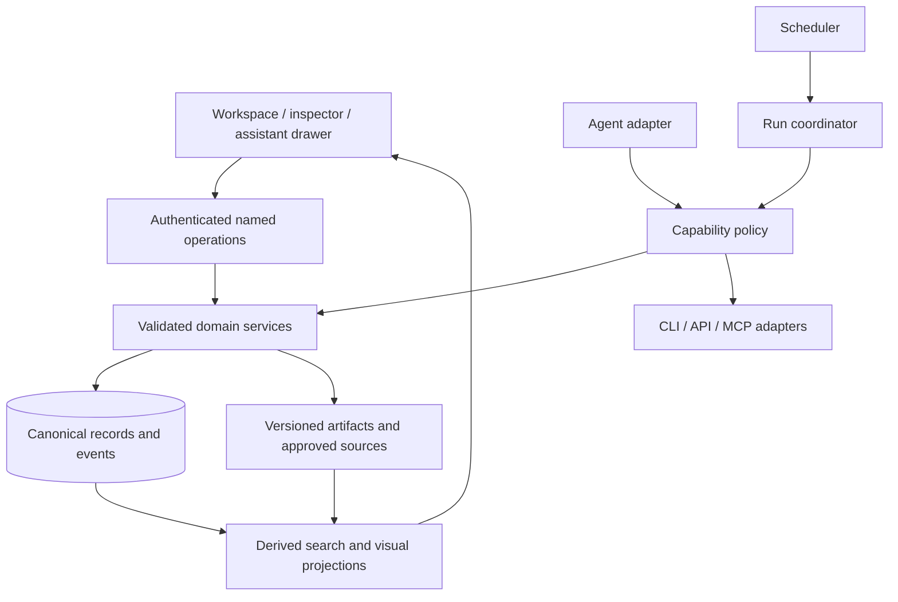

# Reference architecture and contracts

## Boundaries

Use a modular monolith first unless deployment constraints require isolation. Storage, services, adapters and presentation should be separable even in one process. UI code must not query providers on render. Rendering a page cannot silently start paid work.

## Contract inventory

See `contracts/agentos.schema.json` and `templates/`. The schema is an architectural interchange format; the reference runtime uses its smaller concrete records and does not pretend to implement every contract.

- **Source:** stable ID, locator, observed time, content digest, allowed scope, completeness and freshness.
- **Skill:** stable ID/revision, input/output contracts, required capabilities, references, tests.
- **Routine:** job ID/revision, skill reference, source window, timezone, missed-run policy, enabled state, deadline and attempt limit.
- **Run:** unique ID, request/idempotency identity, job/skill/input revisions, execution status, start/end, error, output IDs, validation and usage evidence.
- **Artifact:** stable ID/revision, content digest, source IDs/revisions, run ID and review state.
- **Approval:** actor, permitted operation, target revision/digest, expiry and consumed state where needed.
- **Event:** monotonic sequence within a stream, run ID, event kind, timestamp, safe payload.
- **Layout:** workspace ID, schema version, revision, stable widget IDs, order/size/visibility. No domain state.

## Three independent state axes

| Axis | Suggested states | Meaning |
| --- | --- | --- |
| Execution | queued, running, succeeded, failed, blocked, interrupted, cancelled, unknown | What happened to work |
| Validation | pending, passed, failed | Whether output satisfies the contract |
| Review | not_required, pending, accepted, rejected, superseded | Whether a person adopted a result |

A run can succeed with failed validation. A valid draft can be rejected. An unknown external effect cannot be marked cancelled merely because the client closed.

## Persistence and concurrency

Choose SQLite for a bounded local writer; choose a transactional server database when multiple workers need concurrent claims. Verify locking behavior on the database actually used in deployment. Use uniqueness constraints for occurrence/request identity and compare-and-swap revisions for edits. Recheck input freshness and authority immediately before consequential effects.

For a worker pool: claim under a short transaction, assign a lease and fencing token, execute outside the transaction, and finalize only while the token and revision still match. A stale worker must not overwrite a newer owner. Retries are bounded by effect semantics. For an unknown send outcome, lookup by the stable provider request ID before deciding what to do.

## Model integration

Define a provider-neutral adapter with `start(work_order, context, capabilities)`, an event iterator and `cancel(run_id)`. Normalize deltas, usage, errors and completion. Record usage as unknown when not reported. Enforce wall time, allowed tools and output size outside prompts. Credentials and server routes remain outside frontend bundles.

A local process adapter should use an argument vector without shell interpolation, a controlled environment and working directory, explicit available integrations and process-group cancellation. Authentication, CLI flags and provider protocol support must be checked against the installed version and current official docs during implementation. This repo does not assume a particular subscription grants API credits.

## Workspace projection

The graph shows persisted relations; a relationship may be `contains`, `derived_from`, `produced_by`, `requires_review` or a domain-specific relation. Do not generate convincing edges from unvalidated model prose. Indexes can be rebuilt. An inspector opens objects by ID and revision, never arbitrary filesystem paths.

## Reference implementation boundary

`reference/core.py` implements local intake, a deterministic draft, idempotent requests, digest-bound review and event records in SQLite. `reference/server.py` serves only named assets and routes on loopback with same-origin session protection. It has no model process, distributed lease, background worker or external effect. It is not a hardened multi-user web framework.
