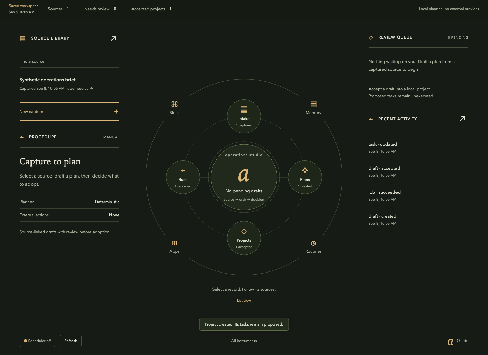
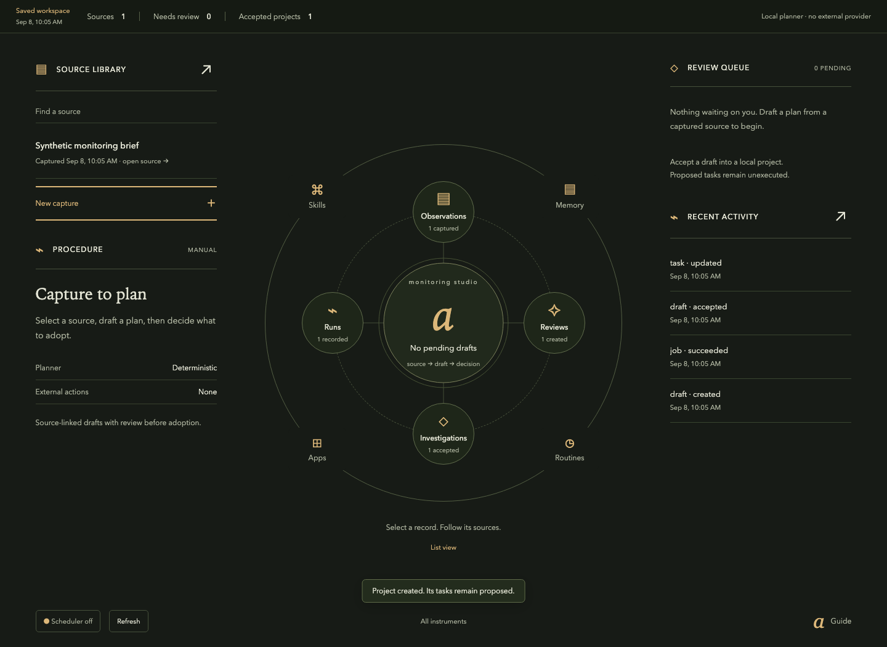

# Domain profiles

These are synthetic starting points. The selected profile changes domain labels and contextual work views while preserving the central circle and layered orbits; it does not connect an external account. Each keeps the ARMS loop while changing its domain objects, composition and permitted actions. The scaffolder copies the selected profile into `workspace-profile.json`.

| Profile | First loop | Contextual work view |
| --- | --- | --- |
| `research` | Capture source → draft research plan → review → accepted project | Evidence workbench |
| `operations` | Intake → draft action plan → review → project | Modular board |
| `monitoring` | Dated observation → review plan → accepted investigation | Anchored domain map |

Do not imply trading, email or cloud execution from these examples. Add one tested application adapter only when needed and authorized.

Worked inputs and expected outcomes: [research](worked/research/README.md), [operations](worked/operations/README.md), [monitoring](worked/monitoring/README.md).

